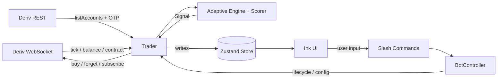
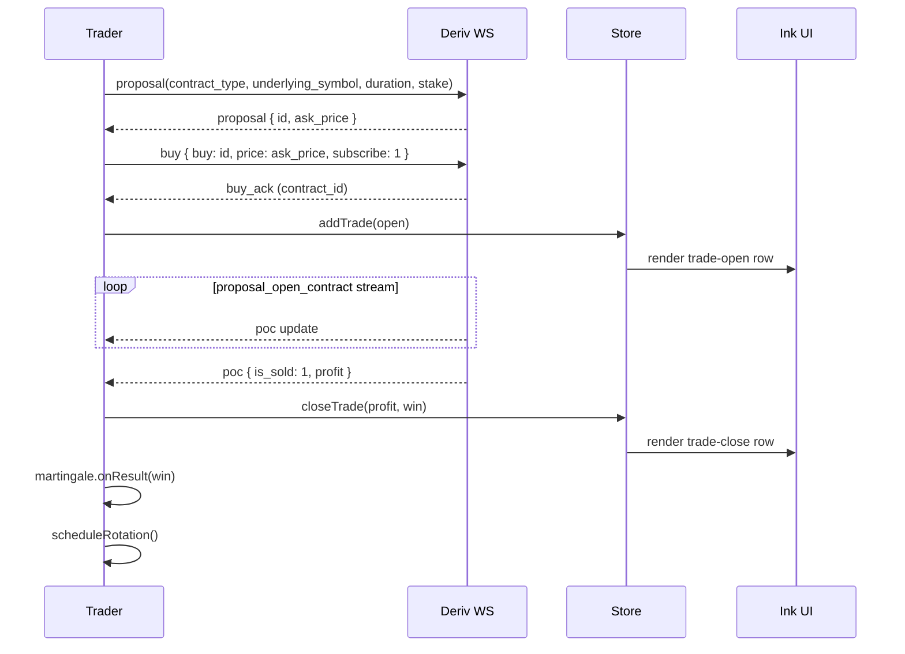
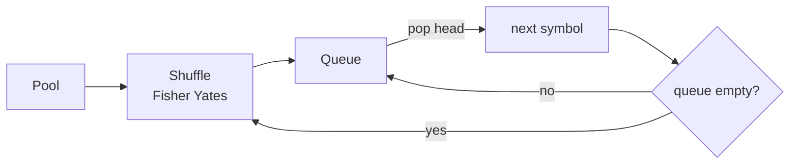

<div align="center">

# kairos-trade

**Tick based adaptive auto trading CLI for Deriv synthetic indices.**

A Bun + Ink (React in terminal) REPL that streams ticks over WebSocket, detects adaptive price jump signals using three parallel statistical estimators, and trades `CALL` / `PUT` contracts of configurable tick duration.


</div>

---

## Why this exists

Synthetic indices (Volatility 100 1s and friends) move on a fixed tick cadence with heavy tailed delta distributions. Generic indicators (RSI, MACD, fixed band Bollinger) respond slowly because they assume quote normality and lag through regime shifts. `kairos-trade` is a focused experiment in the opposite direction:

1. **Adaptive thresholds instead of fixed.** Three estimators run in parallel (Welford rolling variance, EWMA, CUSUM) and the firing band is derived, not tuned.
2. **Signal scoring over signal detection.** Threshold crossings are common, decent setups are rare. A composite score collapses magnitude, velocity, consistency, volatility squeeze, and regime shift into a 1 to 3 strength.
3. **Fast iteration in the terminal.** Ink + slash command REPL gives the same ergonomics as Claude Code. No browser, no dashboard, `/start`, watch, tweak, `/stop`.
4. **Safe by default.** Launch flags only set session defaults. The bot does not auto start. `--dry-run` simulates fills off the real tick stream with zero exposure.

The project is a research tool, not an alpha factory. It exists to make short horizon signal experiments cheap to run.

---

## Features

- **Adaptive threshold engine** combining Welford, EWMA, and CUSUM on tick deltas
- **1-3 strength scoring** with squeeze and regime bonuses
- **Slash command REPL** with autocomplete menu and nested selection menus
- **Multi symbol rotation** using Fisher Yates shuffled permutations, with pre warmed engines per pool member
- **Fuzz duration** sampling tick hold times uniformly from `[min, max]`
- **Classic martingale** with arm after, step cap, stop loss, take profit, and on cap policy
- **Dry run mode** driven by live ticks, no `buy` calls sent
- **Session rollover** transparently refreshes the Deriv OTP before the 1h cap
- **Reactive reconnect** with exponential backoff on unexpected drops
- **In memory transcript** of signals, trades, warmup, rotation, and errors

---

## Architecture

Data flows strictly one way. The UI never talks to the WebSocket, it only subscribes to Zustand state.



**Key piece responsibilities:**

| Module | Role |
| --- | --- |
| `services/derivRest.ts` | `listAccounts`, `getOtpUrl`, `pickDefaultAccount` (prefer DEMO). |
| `services/derivWS.ts` | Single WS client. `req_id` correlation, 30s ping, typed helpers, `proposal` then `buy: id, price, subscribe:1`. |
| `engine/adaptiveThreshold.ts` | Welford + EWMA + CUSUM + Bollinger squeeze detection. |
| `engine/signalScorer.ts` | Composite score to 1-3 strength, squeeze bumps. |
| `engine/rotation.ts` | Fisher Yates shuffle per cycle, fuzz duration sampler. |
| `trading/trader.ts` | Orchestrator. Per symbol engine map, warmup, rotation, martingale, dry run path. |
| `trading/controller.ts` | Thin lifecycle wrapper the UI owns. |
| `state/store.ts` | Source of truth for config, connection, stats, transcript, menu stack. |

---

## Signal engine

The engine runs per tick on `delta = |quote - prevQuote|` and maintains three estimators. The firing threshold is the **min** of the two variance based bands, so whichever reacts faster gates the signal.

```mermaid
flowchart TD
  Q[tick quote] --> D[delta = abs(quote - prev)]
  D --> W[Welford rolling var<br/>window 100]
  D --> E[EWMA span 20<br/>alpha = 2 / (span+1)]
  D --> C[CUSUM two sided<br/>k = 0.5 sigma, h = 4 sigma]
  W --> TH1[mu + k_sens * sigma]
  E --> TH2[mu + k_sens * sigma]
  TH1 --> MIN{{min}}
  TH2 --> MIN
  MIN --> FIRE[delta > threshold?]
  C --> REGIME[regime shift detected]
  FIRE --> SCORE[SignalScorer]
  REGIME --> SCORE
  BW[Bollinger bandwidth<br/>window 50] --> SQZ[squeezeActive]
  SQZ --> SCORE
  SCORE --> OUT[(Signal, strength 1-3)]
```

**Scoring formula:**

```text
score = 0.50 * magnitude
      + 0.20 * velocity
      + 0.15 * consistency
      + 0.15 * squeezeBonus
      + 0.10 * cusumBonus

spike    => force strength 3   (delta > mu + 5 sigma)
squeeze  => strength += 1
```

**Sensitivity levels** (multiplier applied to stddev when forming the band):

| Level | Multiplier | Trade off |
| --- | --- | --- |
| `low` | 1.0 | Permissive, more trades, more noise. |
| `medium` | 1.5 | Default. Balanced. |
| `high` | 2.0 | Selective. |
| `elite` | 3.0 | Only extreme jumps. |

`WARMUP_TICKS = 20` gates any firing. `seedHistory()` preloads 500 historical ticks over REST before subscribing.

---

## Trade lifecycle



**Trade gate:** a trade is placed only when all of:

```text
not paused
AND signal.strength >= minStrength
AND openTrades.length < maxConcurrent
```

**Duration precedence:** `fuzz > adaptive > fixed`.

---

## Quick start

### Prerequisites

- [Bun](https://bun.sh) 1.1+
- A Deriv Personal Access Token with scopes: `Read`, `Trade`, `Trading Information`, `Payments`. Create one at <https://app.deriv.com/account/api-token>.

### Install

```bash
git clone https://github.com/dinethlive/kairos-trade.git
cd kairos-trade
bun install
cp .env.example .env
# edit .env, set KAIROS_TRADE_TOKEN=pat_...
```

### Run

```bash
bun run start                           # opens the REPL, nothing is traded yet
bun run start -- --dry-run              # session default = simulate
bun run start -- --symbol R_100 --stake 0.5 --duration 5
```

The REPL opens immediately. Run `/start` to connect, warm up, and begin trading. Run `/stop` or `Ctrl+C` to shut down gracefully.

### Build a standalone Windows exe

```bash
bun run build        # outputs dist/kairos-trade.exe
```

---

## Configuration

Every knob has an env var, a CLI flag, and for live values a slash command. Precedence: `flag > env > default`.

| Concern | Env var | Flag | Slash | Default |
| --- | --- | --- | --- | --- |
| Deriv PAT | `KAIROS_TRADE_TOKEN` | `--token` | n/a | required for `/start` |
| App ID | `KAIROS_TRADE_APP_ID` | `--app-id` | n/a | built in |
| Account ID | `KAIROS_TRADE_ACCOUNT_ID` | `--account` | n/a | first active DEMO |
| Symbol | `KAIROS_TRADE_SYMBOL` | `--symbol` | `/symbol` | `1HZ100V` |
| Stake | `KAIROS_TRADE_STAKE` | `--stake` | `/stake` | `0.35` |
| Duration (ticks) | `KAIROS_TRADE_DURATION` | `--duration` | `/duration` | `5` |
| Sensitivity | `KAIROS_TRADE_SENSITIVITY` | `--sensitivity` | `/sensitivity` | `medium` |
| Min strength | `KAIROS_TRADE_MIN_STRENGTH` | `--min-strength` | `/minstrength` | `2` |
| Max concurrent | `KAIROS_TRADE_MAX_CONCURRENT` | `--max-concurrent` | `/maxconcurrent` | `1` |
| Dry run | `KAIROS_TRADE_DRY_RUN` | `--dry-run` | `/dryrun` | `false` |

Server side rule to remember: Deriv caps `price` and `amount` at **2 decimal places**. Values are rounded before `proposal`.

---

## Slash commands

Typed into the REPL. `/` triggers the autocomplete menu. `Tab` completes, `Enter` submits.

| Command | Effect |
| --- | --- |
| `/start`, `/stop` | Lifecycle. `/start` on a running bot is rejected. |
| `/pause`, `/resume` | Halt or resume trade placement. Ticks keep streaming. |
| `/status` | Print config, account, session stats. |
| `/symbol <sym>` | Hot swap the tick subscription. |
| `/stake <value>` | Change stake per trade. Rebased by martingale. |
| `/duration <ticks>` | Fixed tick hold (loses to fuzz and adaptive). |
| `/sensitivity [low\|medium\|high\|elite]` | No args opens a menu. |
| `/minstrength [1\|2\|3]` | No args opens a menu. |
| `/maxconcurrent <n>` | Cap simultaneous open contracts. |
| `/dryrun [on\|off]` | Toggle simulation. No args opens a menu. |
| `/rotate [on\|off\|status]` | Multi symbol rotation. |
| `/pool [list\|add <sym>\|remove <sym>\|clear\|reset\|refresh]` | Manage rotation pool. |
| `/fuzzduration [on\|off\|<min> <max>]` | Per trade uniform duration. |
| `/martingale ...` | See martingale section. |
| `/account` | Print account id and balance. |
| `/clear`, `/help [cmd]`, `/quit` | Utility. |

---

## Rotation

When rotation is on, every trade cycles to the next symbol in a Fisher Yates shuffled permutation of the pool. When the cycle empties, a fresh permutation is drawn so every pool member trades once per cycle in random order. If the first symbol of a new permutation matches the last emitted one (pool size >= 2), it is swapped to break the repeat.



**Why it matters:**

- Spreads exposure across correlated but not identical processes (different volatility classes).
- Breaks per symbol overfitting since the engine resets state pointer per rotation.
- Pre warming is parallel, so rotation latency is a state pointer swap, not a network fetch.

Symbols that fail to warm are dropped from the rotation and logged as warnings. `/pool refresh` pulls live `active_symbols` over the public Deriv WS and keeps `synthetic_index` entries that are open and not suspended.

---

## Fuzz duration

```bash
/fuzzduration on
/fuzzduration 5 10        # sample uniform integer in [5, 10]
/fuzzduration off
```

Purpose: break deterministic tick hold patterns that adversarial pricing can fit to. When on, precedence is `fuzz > adaptive > /duration`.

---

## Martingale

Loss recovery stake scaling. Off by default in runtime behavior unless the arm condition is met.

| Param | Env | Default | Meaning |
| --- | --- | --- | --- |
| Mode | `KAIROS_TRADE_MG` | `classic` | Currently only `classic`. |
| Multiplier | `KAIROS_TRADE_MG_MULT` | `2.2` | Next stake = current * multiplier. |
| Max steps | `KAIROS_TRADE_MG_MAX_STEPS` | `8` | Cap on scale ups. |
| Arm after | `KAIROS_TRADE_MG_ARM_AFTER` | `2` | Consecutive losses before scaling. |
| Max stake | `KAIROS_TRADE_MG_MAX_STAKE` | `off` | Hard cap per trade. |
| Stop loss | `KAIROS_TRADE_MG_STOP_LOSS` | `200` | Session loss cap. |
| Take profit | `KAIROS_TRADE_MG_TAKE_PROFIT` | `off` | Session profit target. |
| On cap | `KAIROS_TRADE_MG_ON_CAP` | `reset` | `reset` or `halt` at max steps. |

**Important:** martingale state (`mgStep`, `mgConsecLosses`) is **global** across symbols. A loss on symbol A arms the next trade on symbol B. This is intentional for session level risk accounting and is the reason stop loss / take profit are both session scoped.

---

## Transcript

```text
HH:MM:SS  STATUS      connected, account=VRTC12345, balance=1000.00
HH:MM:SS  WARMUP      seed=500, live=20, ready
HH:MM:SS  SIGNAL      1HZ100V, strength=3, delta=0.12, threshold=0.07, CALL
HH:MM:SS  TRADE-OPEN  id=12345, sym=1HZ100V, type=CALL, stake=0.35, dur=5
HH:MM:SS  TRADE-CLOSE id=12345, profit=+0.33, win=true
HH:MM:SS  MG          step=0, stake=0.35  (reset on win)
HH:MM:SS  ROTATE      1HZ100V -> R_75
```

Bounded at `MAX_TRANSCRIPT = 400` rows, visible tail is 30.

---

## Project layout

```text
src/
  cli/            arg parser, banner, help text
  constants/      API endpoints, warmup windows, sensitivity levels
  services/
    derivRest.ts  REST helpers (accounts, OTP)
    derivWS/      WS client, active_symbols, normalize, types
  engine/
    adaptiveThreshold.ts   Welford + EWMA + CUSUM + squeeze
    signalScorer.ts        1-3 strength scoring
    rotation.ts            Fisher Yates + fuzz sampler
  state/
    store.ts      Zustand store (config, transcript, menus, stats)
  trading/
    config.ts, martingale.ts, engineStates.ts, session.ts,
    placeTrade.ts, reconciler.ts, trader.ts, controller.ts
  ui/
    App.tsx, theme.ts, menu.ts,
    components/   Header, Transcript, Prompt, CommandMenu, SelectMenu
  commands/
    registry.ts, commands/*, menus/*, handlers/*
  index.tsx       Ink render entry
tests/
  engine/, services/, state/, trading/, ui/
```

---

## Development

```bash
bun run typecheck     # tsc --noEmit, strict
bun run test          # bun test
bun run test:watch
bun run dev           # bun --watch src/index.tsx
bun run build         # dist/kairos-trade.exe
bun run link          # expose `kairos-trade` globally
```

No linter or formatter is configured. `tsconfig` runs strict. Tests use `bun test`.

---

## Extending

| Task | Where |
| --- | --- |
| Add a signal feature | Extend `ThresholdResult` in `engine/adaptiveThreshold.ts`, consume in `engine/signalScorer.ts`. Preserve warmup gating. |
| Add a tunable | Constant in `constants/api.ts`, flag + env in `cli/args.ts`, field on `TraderConfig`, slash command in `commands/registry.ts`. |
| Add a slash command | Append to `COMMANDS` in `commands/registry.ts`. Autocomplete picks it up automatically. Menu style handlers call `ctx.openMenu`. |
| Add a contract type | Extend `DerivWS.buyContract` params and the `TradeContractType` union in `types/index.ts`. |
| Add a transcript kind | Extend `TranscriptKind` in `types/index.ts` and `tagFor` in `ui/components/transcript/Row.tsx`. |

---

## Roadmap

- [ ] Additional contract shapes (higher / lower, touch / no touch)
- [ ] Persistent session stats across runs
- [ ] Pluggable scoring strategies
- [ ] Optional remote web dashboard mirroring the store

---

## Disclaimer

> This project is a **research and engineering experiment**. It is **not financial advice**, not a recommendation to trade, and not a promise of profit. Trading leveraged and synthetic products carries a material risk of loss, including the loss of the entire account balance. Past performance of any statistical model, including the adaptive threshold engine shipped here, is not indicative of future results. You are solely responsible for any trades placed using this software. Use `--dry-run` until you understand the behavior, and do not run against a real account with funds you cannot afford to lose.

---

## License

MIT. See `LICENSE` (or the `license` field in `package.json`).

---

<div align="center">
Built with Bun, Ink, React, and Zustand.
</div>
